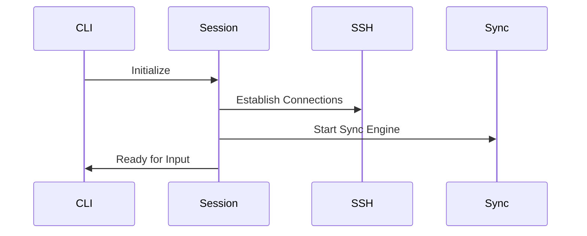
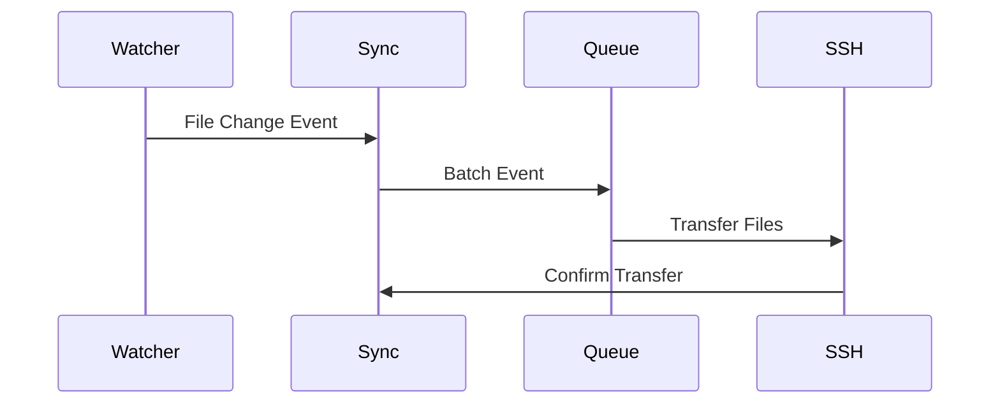

# Architecture

## Core Components

```
┌─────────────────┐     ┌──────────────┐     ┌─────────────────┐
│  CLI Interface  │────▶│ Session Mgr  │────▶│  Sync Engine    │
└─────────────────┘     └──────────────┘     └─────────────────┘
                              │                       │
                              ▼                       ▼
                        ┌──────────────┐     ┌─────────────────┐
                        │  SSH Client  │     │ File Watcher    │
                        └──────────────┘     └─────────────────┘
```

### Component Details

1. **CLI Interface**
```rust
pub struct CliOptions {
    host: String,
    volumes: Vec<VolumeMapping>,
    interactive: bool,
    ssh_options: Vec<String>,
    sync_options: SyncOptions,
}

pub struct VolumeMapping {
    local: PathBuf,
    remote: PathBuf,
    options: VolumeMappingOptions,
}
```

2. **Session Manager**
```rust
pub struct Session {
    shell_connection: Box<dyn SshConnection>,
    sync_connection: Box<dyn SshConnection>,
    volumes: Vec<VolumeMapping>,
    sync_manager: SyncManager,
}

impl Session {
    async fn start_interactive(&mut self) -> Result<()>;
    async fn handle_shell_io(&mut self) -> Result<()>;
    fn setup_environment(&self) -> Result<()>;
}
```

3. **Sync Engine**
```rust
pub struct SyncManager {
    volumes: Vec<VolumeMapping>,
    watchers: HashMap<PathBuf, FileWatcher>,
    queue: SyncQueue,
    status: Arc<RwLock<SyncStatus>>,
}

impl SyncManager {
    async fn sync_file(&mut self, event: FileEvent) -> Result<()>;
    async fn handle_conflict(&mut self, conflict: Conflict) -> Result<()>;
    fn optimize_batch(&self, events: Vec<FileEvent>) -> Vec<FileEvent>;
}
```

4. **SSH Client**
```rust
pub trait SshConnection {
    async fn connect(&mut self) -> Result<()>;
    async fn execute(&mut self, command: &str) -> Result<Output>;
    async fn sftp_session(&mut self) -> Result<Box<dyn SftpSession>>;
    async fn shell(&mut self) -> Result<()>;
}
```

## Data Flow

### 1. Startup Sequence


### 2. File Synchronization


## Key Design Decisions

1. **Connection Management**
   - Separate connections for shell and sync operations
   - Connection pooling for multiple file transfers
   - Automatic reconnection handling

2. **File Synchronization**
   - Event-based file watching
   - Batching of similar operations
   - Conflict detection and resolution
   - Checksums for change detection

3. **Performance Optimizations**
   - Local caching of file metadata
   - Compression for transfers
   - Smart batching of operations
   - Connection reuse

4. **Error Handling**
   - Graceful degradation
   - Automatic retry mechanisms
   - Detailed error reporting
   - Transaction-like operations

## Configuration

```rust
pub struct Config {
    sync: SyncConfig,
    ssh: SshConfig,
    performance: PerformanceConfig,
}

pub struct SyncConfig {
    batch_size: usize,
    sync_interval: Duration,
    retry_strategy: RetryStrategy,
    conflict_resolution: ConflictStrategy,
}

pub struct PerformanceConfig {
    compression_level: u8,
    max_concurrent_transfers: usize,
    cache_size: usize,
    network_throttle: Option<Bandwidth>,
}
```

## Security Considerations

1. **SSH Security**
   - Use existing SSH config and known_hosts
   - Support for key-based authentication
   - Respect SSH security settings

2. **File Permissions**
   - Preserve file permissions
   - Handle permission conflicts
   - Secure temporary file handling

3. **Data Security**
   - Encryption in transit (via SSH)
   - Secure handling of sensitive files
   - Optional ignore patterns for sensitive data

## Testing Strategy

1. **Unit Tests**
```rust
#[cfg(test)]
mod tests {
    use super::*;
    use mockall::*;

    #[test]
    async fn test_sync_operation() {
        let mock_ssh = MockSshClient::new();
        let sync = SyncManager::new(mock_ssh);
        // Test sync operations
    }
}
```

2. **Integration Tests**
   - Docker-based test environment
   - Real SSH server testing
   - Network condition simulation
   - Performance benchmarking

## Future Considerations

1. **Extensibility**
   - Plugin system for custom sync strategies
   - Hook system for custom actions
   - API for external tool integration

2. **Scalability**
   - Multiple remote support
   - Cluster synchronization
   - Distributed operation

3. **Monitoring**
   - Metrics collection
   - Performance tracking
   - Usage analytics
